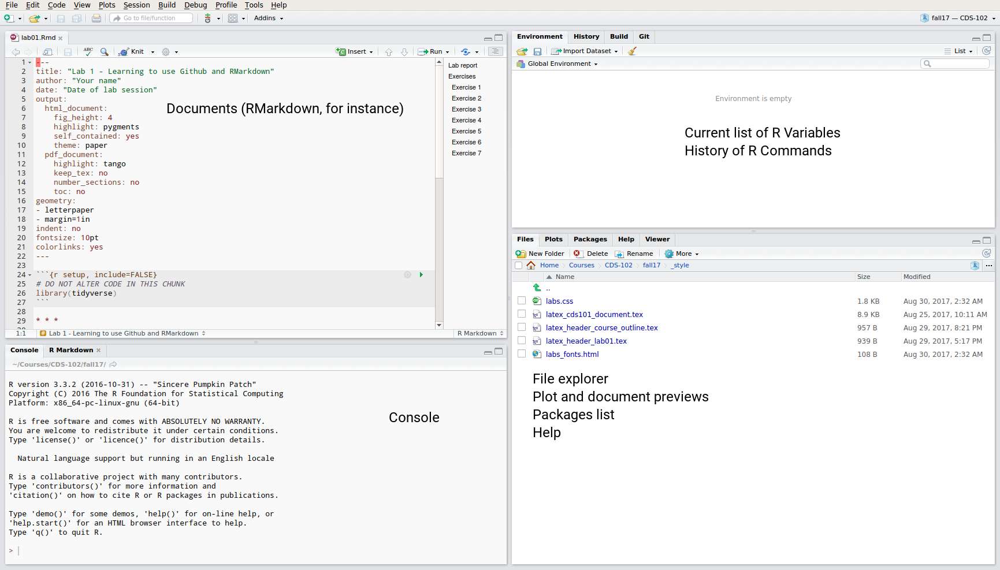

class: center, middle, title-slide

.upper-right[
```{r logo, eval = TRUE, echo = FALSE, out.width = "605px"}
knitr::include_graphics("img/cds-102-2a1-logo.png")
```
]

.lower-right[
```{r cc-by-sa, eval = TRUE, echo = FALSE, out.width = "88px"}
knitr::include_graphics("img/cc-by-sa.png")
```

These slides are licensed under a [Creative Commons Attribution-ShareAlike 4.0 International License](http://creativecommons.org/licenses/by-sa/4.0/).
]

# Lab 1: Reproducible research with RMarkdown and Github
.title-hline[
## May 24, 2018
]

---

class: middle, center, inverse

# Getting started

```{r setup, include = FALSE, eval = TRUE, echo = FALSE}
# DO NOT ALTER THIS CHUNK
knitr::opts_chunk$set(echo = TRUE, eval = TRUE, fig.width = 6, warning = FALSE,
                      message = FALSE, dev = "svg",
                      fig.asp = 0.618, out.width = "70%", dpi = 120,
                      fig.align = "center", cache = FALSE)
options(htmltools.dir.version = FALSE)
# Load required packages
suppressPackageStartupMessages(library(tidyverse, quietly = TRUE))
suppressPackageStartupMessages(library(vembedr, quietly = TRUE))
suppressPackageStartupMessages(library(htmltools, quietly = TRUE))
```

---

# RStudio interface

.vhalign-slide[
Navigate to <https://rstudio.cos.gmu.edu> and login with your Mason NETID and password.
]

---

count: false

# RStudio interface

.valign-slide[
```{r rstudio-interface, echo = FALSE, out.width = "100%"}

```
]

---

# Installing tidyverse

.valign-slide[
If you haven't done so in your CDS-101 class, type the following in your *Console* window to install the necessary packages to get started:

```r
install.packages("tidyverse")
```
]

---

# Github

.valign-slide[
* Please sign up for an account on Github (http://github.com) using your Mason email address if you do not have one already

* If you already have a Github account, please update your profile to use your Mason email address

* If you would prefer to not do this, then create a second account using your Mason email address instead
]

---

# Obtain Repository

.valign-slide[
* Click the link distributed to you in Slack to get your Lab 1 repository and accept the assignment

* Click "Clone or Download", and make sure it says "Use HTTPS" in bold in the top left of the pop-up box.

* Click the clipboard to copy the link

* In RStudio, go to File → New Project.

* Click Version Control, then Git.

* Paste the link you just copied into the Repository URL box.

* Leave the Project directory name blank.

* Click Browse and create a directory where you store your labs, for example as `CDS102`, and select it.
]

---

# Obtain Repository

.valign-slide[
* An RStudio project should now open up, which will allow you to start working on your homework assignment.

* You will probably see a blank console screen.

* However, in RStudio you should also see a list of all of the files available.

* Click on the `lab01.Rmd` file and edit away.

* If you save and close R Studio and want to go back to editing your project, open up R Studio, then go to File → Open Project.

* Navigate to the project directory and double click on the .Rproj file.
]

---

# Getting familiar with RMarkdown

.valign-slide[
```{r rmarkdown-video, echo = FALSE}
embed_vimeo(id = "178485416", width = "100%", height = 350, allowfullscreen = TRUE, frameborder = 0)
```
]

---

# .font80[Using symbols to "mark up" your document]

* As you can see, the combination of RMarkdown and RStudio combines text processing with the ability to execute code written in R.

* However, unlike software like Microsoft Word, there aren't any formatting buttons for doing things like creating **bold** or *italicized* text.

* RMarkdown does this using symbols that stand for different types of text markups.

* For example, typing `**bold text**` in RMarkdown signals you want the words `bold text` to be bolded.

* Paragraphs are separated by a blank line, for example:

```md
This is the end of the first paragraph.

This starts the next paragraph.
However, putting a line right below it will not start a new paragraph.
```

---

# Time to practice!

.valign-slide[
Read through your lab instructions and complete the marked exercises. Be sure to save, commit, and push! You will also be guided through opening a pull request to formally submit the lab.
]
